# Pixel Catcher
**An Interactive LED Game Using Combinational and Sequential Logic Design**

*Semester Project: Digital Logic Design*

*By Waleed Ahmad*

## Dedication Acknowledgement

This project is sincerely dedicated to all those who find joy and curiosity in the realm of digital logic and interactive design. I extend my deepest gratitude to my professor, Engr. Arshad Nazir, whose guidance, and expertise were invaluable in steering this project towards success. His insights and encouragement have been a source of inspiration and learning. I am equally thankful to my lab engineer, Jafar Hussain, whose hands-on support and technical assistance in the laboratory were instrumental in bringing the theoretical aspects of this project to life. This journey would not have been possible without the state-of-the-art facilities and stimulating environment provided by the National University of Science and Technology (NUST). The university has been a nurturing ground for innovation and practical skills, for which I am profoundly grateful. This project stands as a testament to the collaborative efforts and shared knowledge of these individuals and the institution.

## Abstract
For my final project, I developed a game on a grid of 72 LEDs, arranged in 9 rows and 8 columns, where the player maneuvers a light representing a platform in left or right direction using two buttons on each side of the console, strategically catching falling objects (LEDs glowing in a pattern giving illusion of falling from top to bottom). Control is achieved through two momentary pushbuttons. When the player successfully aligns the platform under a falling object on the bottom row, the score increments, displayed on a two-digit seven-segment display. Conversely, failing to do so results in an increased death count, indicated on a third seven-segment display. The game concludes upon reaching 10 deaths, at which point the game clock is disabled, freezing the objects on the screen to signal the game's end.

To simulate falling objects on the LED display, each row of LEDs is connected to a single 3:8 decoder. I utilized an asynchronous counter linked to a fast clock to generate a pseudo-random 3-bit address for the top row. This address is then sequentially passed down each row using 3 sets of flip flops, functioning as a modified ring counter. At the bottom, a comparator assesses whether the address of the falling object matches that of the platform light, determining whether to increment the score or death count. The platform row itself employs an up/down counter, adjusting the selected address based on the pressed button. A flip flop coupled with a fast clock introduces a slight delay, ensuring the counter has adequate time to switch counting modes before altering the count upon button activation. Additional logic was required to fully realize this design, which will be elaborated upon later in the document.

# Chapter 1: Introduction

## 1.1 Overview
This project was conceived to provide a delightful and relaxing activity suitable for children and individuals of all ages. It takes the form of an LED following game, incorporating a blend of combinational and sequential circuit designs.

The system's input is a 3-bit random code, which is fed to decoders. These decoders then process the code and transmit it to the LED grid. Prior to this decoding process, flip-flops are utilized to alternate between odd and even LEDs, creating the illusion of falling lights. At the game's forefront is a row of player-controlled LEDs. The position of these illuminated LEDs can be altered using push buttons, allowing them to move back and forth across the grid. The game also features a scoring system and a death counter. When the falling and controlled LEDs align, the player's score increases. Conversely, a mismatch results in an increment to the death count. Upon reaching 9 deaths, a buzzer sounds, and the game pauses, signaling the end of that round. 

[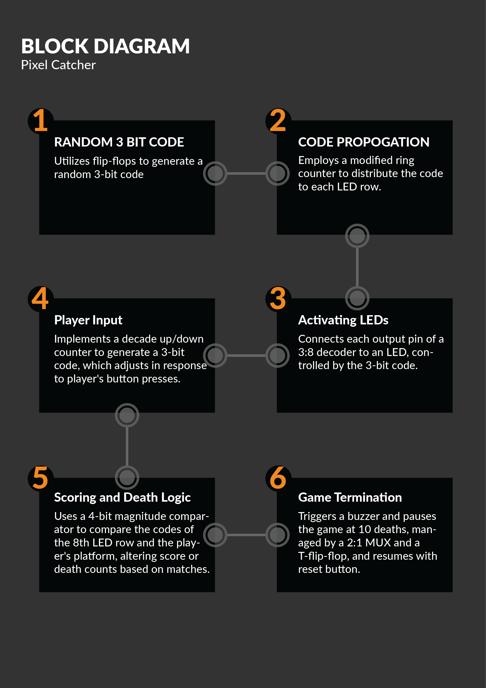](images/TREE.png)

# Chapter 2: Design

## 2.1 Problem Statement

The objective of this project is to design an interactive game using an 8x8 grid of LEDs, alongside an additional row designated as the player’s platform. The core gameplay involves a single LED lighting up randomly on the top row of the grid at the start. To maintain the game's playability, it's essential that no more than one LED is active per row simultaneously. The LEDs should be programmed to move downwards in a pattern that mimic falling, achieved through the strategic use of flip-flops. The player's platform is controlled via a horizontal LED, which moves left or right in response to the player pressing the corresponding forward or reverse buttons on the controller, implemented through a decade up/down counter.

The game’s scoring mechanism is governed by a 4-bit magnitude comparator. When the player successfully aligns their platform LED directly under a descending grid LED, the score is incremented. Failure to do so results in an increase in the death count. Both scores and deaths are displayed on a 7-segment display. The game is designed to pause when the player reaches 10 deaths. This pause function is facilitated by a MUX that discontinues the clock signals to the flip-flops, while simultaneously activating a buzzer to indicate the game over state.

## 2.2 Technical Foundations of the Game Design
This section provides an in-depth look at the foundational elements that form the logic and functioning of the game. Detailed below are the truth tables and state diagrams that delineate the logical operations and state transitions which are critical to the game's mechanics.

### 3:8 Decoder Utilization in LED Rows:
The 3:8 decoder is integral to the game's design, translating a 3-bit input into the activation of a corresponding LED in the grid. The truth table illustrates how the decoder's outputs are mapped to the grid's rows, ensuring that only one LED is illuminated per row.

[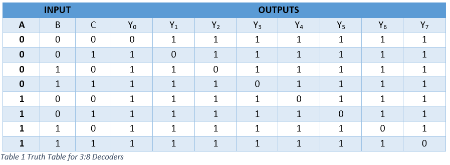](images/img.png)

### 4-Bit Magnitude Comparator
A 4-bit magnitude comparator is used to compare the player's position with the position of the 'falling' LED. Figure 2 and its accompanying truth table demonstrate how the comparator evaluates the player's success in aligning the platform with the descending LEDs, which is critical for scorekeeping.

[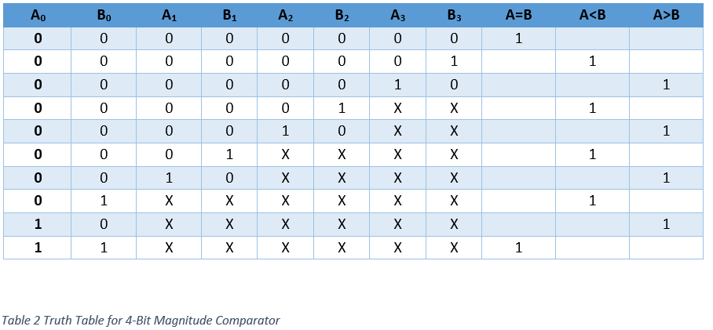](images/img_1.png)

## 2.3	 State Table

### State Table of Decade Counter
The decade counter's state table, shown in Figure 9, outlines the control logic for the player's platform movement, indicating the results of pressing either the forward or reverse switches.

[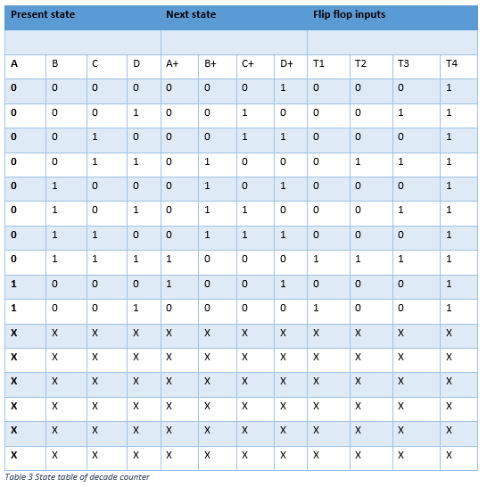](images/img_2.png)

### Flip Flop Output for Propagation Logic
Sequence number	Flip flop outputs
Lastly, Table 4 details the propagation logic through flip flop outputs, which is essential for the downward 'traveling' effect of the LEDs. This sequence is the core of the visual aspect of the game, where LEDs appear to fall from the top to the bottom of the grid

[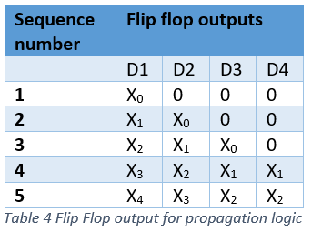](images/img_3.png)

## 2.4 Complete Logic Diagram

Figure below shows the comprehensive logic diagram of the game, laid out in the Proteus simulation environment. This schematic captures the entire electronic design, showcasing how each component interacts within the system. It serves as a visual representation of the game's circuitry, from the LED grid to the player controls and scoring system.

[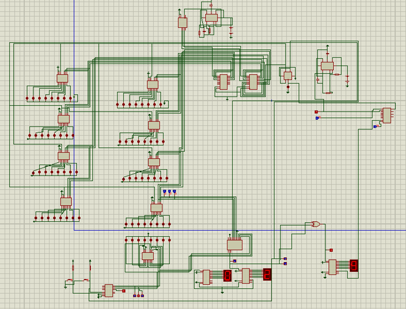](images/img_4.png)

**Figure 3 Proteus Simulation – Complete Schematic**

### Enabling LED matrix:
A 3 to 8 decoder is used to enable one led in a row of 8 at a time. Changing that 3-bit code changes the position of LED. 

[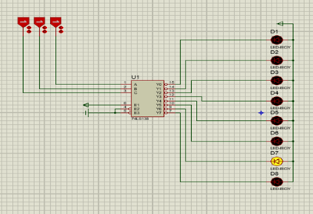](images/img_5.png)

**Figure 4 Enabling LED schematic.**

### Generating Random Bit
A clock signal from a 555 timer is fed to 74193 IC that has 4 toggle flip flops in its internal circuit depending upon the previous state, each flip flop generates a bit on its Q pin which may or may not be equal and hence making a pseudo-random 3-bit code.

[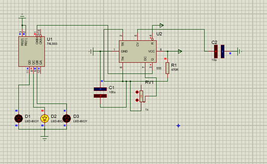](images/img_6.png)

**Figure 5 Random Bit Generation schematic.**

### Switching between Even and Odd rows.
To make the user interface clean and understandable there are only four LEDs that glow at a time on the LED grid, either even or odd. So, to achieve the enable pins of even rows were connected to the Q pin of s D-flip flop and the enables of all the decoders attached to odd rows of LEDs were connected to Q-compliment pin of flip flop. The frequency of this flip flop is exactly double the frequency of the one generating random bit so that the place of glowing LED does not change in the vertical transition. 

[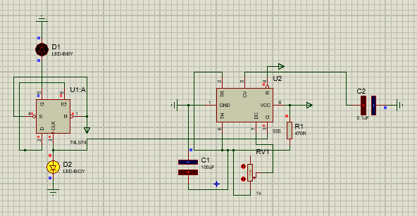](images/img_7.png)

**Figure 6 Even/Odd switching schematic.**

### Player’s controls
To make the player’s controller there were two push buttons attached to 74LS193 decade up down counter. Whenever the buttons were pressed, they gave a low signal to the pins of counter. And with each pulse the counter incremented a BCD code in its output pins. The least significant bits from the counters were fed to the 3:8 decoder to turn on the respective LED.

[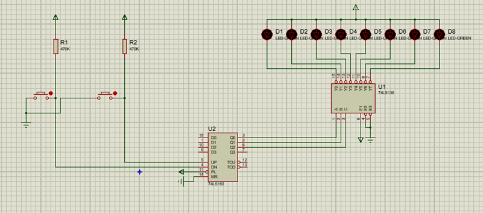](images/img_8.png)

**Figure 7 Players controls schematic.**

### Scoring and Death logic
I used a 4-bit comparator to compare the address of a falling object in the bottom row to the address of the platform light to determine whether the score or death count should be incremented. I had to introduce logic to convey information from the comparator to the counters for the score and deaths. One complication to be considered was that the death count should not be incremented if the bottom row decoder is disabled, even though the address of that decoder probably will not match the platform address. In other words, the death counter should only be incremented if neither the equal pin of the comparator nor the inverse of the decoder enables signal is high. I tied these two signals to the inputs of a XOR gate and connected the clock pin of the death counter to the output of this gate. Similarly, to increase the score, I used the same logic to require that the bottom decoder is enabled, and its address matches the platform address.

[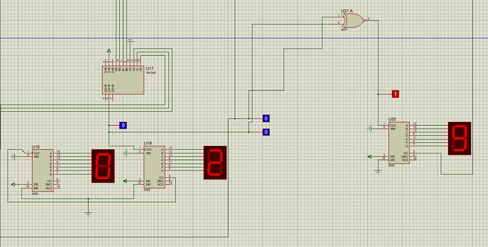](images/img_9.png)

**Figure 8 Scoring schematic.**

### Game pause
I used a 2:1 mux between the line of 555 timer and the flip flops, i.e. when the mux was fed with high pulse from the carry out pin of 4026 counter that was calculating death, the mux switches to open circuit. Thus, the game pauses.

# Chapter 3: Hardware Implementation

## 3.1	Components used.
7400 Series
-	74LS138	3:8 Decoder
-	74HC286	Quad 2-input XOR
-	74LS74	D Flip flop
-	74LS191	up/down counter
-	74LS374	octal flip flop
-	74LS93	binary counter
-	74LS85	4-bit magnitude comparator
-	74LS153	Quad 2:1 multiplexer
-	NE55N 	Timer
-	4026		Decade counter
-	Resistors: 	220Ω, 470k Ω, 1k Ω
-	Capacitors 	10nF, 10uF
-	Wire strips
-	LEDs
-	Breadboard,
-	Vero board
-	Seven segments display.
-	Batteries  

## 3.2 	Hardware Issues, Results, and Observations
### Unconnected Control and Input Pins:
Initially, I encountered signal fluctuations in my circuit where certain signals, expected to be constant or synchronized with the clock, were erratic. This was due to multiple control pins and other input pins on some chips that I left unconnected. By tying these pins to either power or ground, I resolved the issue. It became evident that unconnected pins do not default to a logical state, leading to unpredictable behavior.
### Counter Initialization Issue: 
The counter, intended to track the game's speed stage, often did not initialize to zero as expected, instead starting at mid-range values. Further investigation into the datasheet revealed the solution: implementing a one-shot clock pulse to clear the counter to zero upon startup, ensuring a consistent initial state.
### Flip Flop Selection Error: 
I initially selected the 74 series LS373 octal flip flops for my design, but they failed to produce a predictable sequence. After consulting various datasheets, which often combined information for both the LS373 and LS374, I identified my oversight. The LS373 is positive-triggered, unlike the edge-triggered LS374. Switching to the LS374 provided the expected, stable behavior.
### LED Test Interference:
Test LEDs inserted directly into the breadboard inadvertently diverted current from the main circuit, altering its performance. I remedied this by connecting the entire display for testing, which provided a more accurate representation of the circuit behavior under normal operating conditions.
### Decade Counter Carry Out Issue:
Upon start-up, the 4026 decade-counter incorrectly output a high carry out pulse, which in turn erroneously signaled the multiplexer to pause the game. By integrating a T-flip flop with an AND gate, I managed to eliminate this premature high signal, thus preventing the game from pausing unexpectedly.
### Power Distribution Challenges:
With a significant number of ICs in my design, power distribution was problematic. The issue was resolved by supplying power through laboratory-grade equipment, which provided a stable and sufficient source for the entire circuit.

Each of these observations led to a better understanding of the hardware's nuances and contributed to the overall success of my project. Through systematic troubleshooting and referencing technical documentation, I was able to address the challenges and enhance the reliability of my game's hardware.

# Chapter 4: Project Application
This project was conceived with dual objectives: to craft an entertaining experience and to sharpen reflexes through gameplay. While maintaining an element of fun, I have intricately woven digital logic into the fabric of the game.
The design principles applied in this game have broader implications. For instance, the cascading lights concept can be adapted for decorative purposes, creating patterns that emulate the essence of my game. Furthermore, the scoring mechanism I developed has the potential to be integrated into a wide array of games, particularly those with scoring and life-tracking systems. With appropriate modifications, my scoring logic can enhance the interactive dynamics of other games.
Beyond its primary function as a game, my project serves as a compendium of common gaming logics. It amalgamates various fundamental elements into a single, compact game, demonstrating how basic digital logic can be applied in a playful yet practical manner.
In essence, this project is not only an engaging game but also a versatile logic toolkit. It offers a delightful diversion, a method to pass the time engagingly, and acts as an aesthetically pleasing tool for stress relief. The potential applications of my game's logic extend beyond entertainment, suggesting possibilities for educational tools or interactive displays that engage users while demonstrating the principles of digital logic and user input response.

# Chapter 5: Future Enhancements and Recommendations
As I look toward the future development of this project, several enhancements stand out as opportunities to refine and expand the game's capabilities. Implementing a microcontroller such as an Arduino to control the player's platform could streamline the hardware setup, reducing complexity and potentially allowing for more sophisticated control mechanisms.
To escalate the challenge and engagement over time, I propose incorporating a multiplexer to modulate the resistance in the 555 timer's circuit. This adjustment would increase the timer's frequency incrementally after the player achieves every tenth score. Such a feature would progressively heighten the game's difficulty, enhancing its addictiveness and replay value.
Furthermore, integrating a remote-control system would contribute significantly to the game's convenience and accessibility. Players could benefit from the flexibility of playing from a distance, making the game more inclusive and adaptable to various environments and player preferences.
In addition to these tangible enhancements, future iterations could explore connectivity features such as Bluetooth or Wi-Fi, enabling the game to record high scores or share them on a digital leaderboard. This could foster a community aspect to the gameplay, encouraging competition and social interaction.
These recommendations aim to not only refine the current design but also to broaden the project's appeal and application, ensuring that it remains a compelling and contemporary tool for entertainment.
